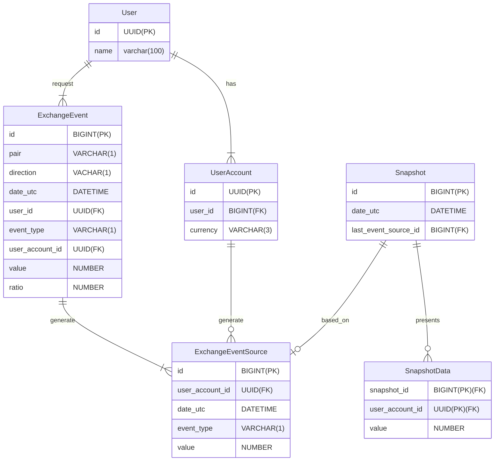

```mermaid
erDiagram
    User {
        id UUID(PK)
        name varchar(100)
    }

    UserAccount {
        id UUID(PK)
        user_id BIGINT(FK)
        currency VARCHAR(3)
    }

    ExchangeEvent {
        id BIGINT(PK)
        pair VARCHAR(1)
        direction VACHAR(1)
        date_utc DATETIME
        user_id UUID(FK)
        event_type VARCHAR(1)
        user_account_id UUID(FK)
        value NUMBER
        ratio NUMBER
    }

    ExchangeEventSource {
        id BIGINT(PK)
        user_account_id UUID(FK)
        date_utc DATETIME
        event_type VARCHAR(1)
        value NUMBER
    }

    Snapshot {
        id BIGINT(PK)
        date_utc DATETIME
        last_event_source_id BIGINT(FK)
    }

    SnapshotData {
        snapshot_id BIGINT(PK)(FK)
        user_account_id UUID(PK)(FK)
        value NUMBER
    }

    User ||--|{ ExchangeEvent: request
    User ||--|{ UserAccount: has
    ExchangeEvent ||--|{ ExchangeEventSource: generate
    UserAccount ||--o{ ExchangeEventSource: generate
    Snapshot ||--o| ExchangeEventSource: based_on
    Snapshot ||--o{ SnapshotData: presents

```