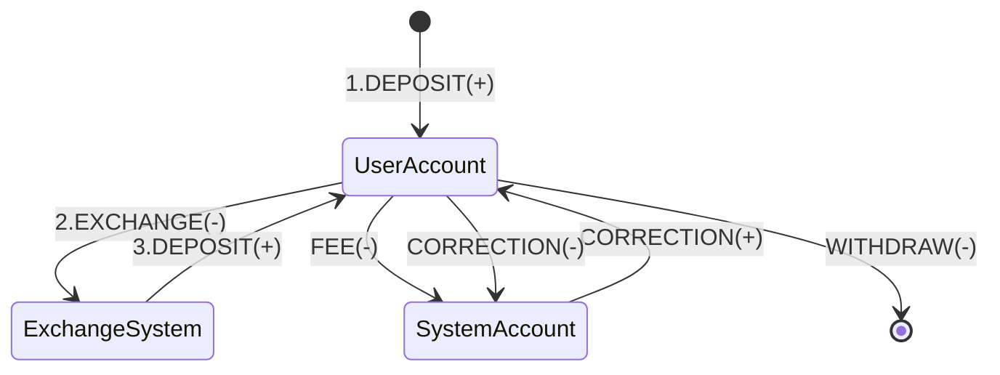

Requirements:

- partial exchange allowed
- fees paid after full exchange or when exchange canceled
- fees for cancelled exchange calculated for exchanged part
- fee paid with Destination currency

# Events generated for the specific operations

Financial Events in the system for the specific operations

## Deposit ( without fees )

| Account            |               Value                | Currency | Event Type |
|--------------------|:----------------------------------:|----------|------------|
| User A account EUR | + 100.00 | EUR      | DEPOSIT    |

## Deposit ( with fees )

| Account              |               Value                | Currency | Event Type |
|----------------------|:----------------------------------:|----------|------------|
| User A account EUR   | + 100.00 | EUR      | DEPOSIT    |
| Exchange account EUR |   - 0.10   | EUR      | FEE        |

## Exchange Request

| Account              |               Value                | Currency | Event Type | Ratio |
|----------------------|:----------------------------------:|----------|------------|-------|
| User A account EUR   |  - 100.00  | EUR      | EXCHANGE   | 1.3   |
| Exchange account EUR | + 100.00 | EUR      | DEPOSIT    | 1.3   |

## Cancel Full Exchange Request

| Account              |               Value                | Currency | Event Type |
|----------------------|:----------------------------------:|----------|------------|
| Exchange account EUR |  - 100.00  | EUR      | WITHDRAW   |
| User A account EUR   | + 100.00 | EUR      | DEPOSIT    |

## Full Exchange Result

_Before exchange_

| Account              |               Value                | Currency | Event Type | Ratio |
|----------------------|:----------------------------------:|----------|------------|:-----:|
| User A   account EUR |  - 123.00  | EUR      | EXCHANGE   | 1.23  |
| Exchange account EUR | + 123.00 | EUR      | DEPOSIT    | 1.23  |
| User B   account USD |  - 100.00  | USD      | EXCHANGE   | 1.23  |
| Exchange account USD | + 100.00 | USD      | DEPOSIT    | 1.23  |

**{EXCHANGE OPERATION between EUR and USD with ratio 1.23, after exchange fees calculated for User A and B }**

_After exchange_

| Account              |               Value                | Currency | Event Type | Ratio |
|----------------------|:----------------------------------:|----------|------------|:-----:|
| Exchange account USD |  - 100.00  | USD      | WITHDRAW   |       |
| User A account USD   | + 100.00 | USD      | DEPOSIT    | 1.23  |
| User A account USD   |   - 0.10   | USD      | FEE        |       |
| Exchange account EUR |  - 123.00  | EUR      | WITHDRAW   |       |
| User B account EUR   | + 123.00 | EUR      | DEPOSIT    | 1.23  |
| System account EUR   |   - 0.10   | EUR      | FEE        |       |

## Full Exchange Result With Different Rates

_Before exchange_

| Account              |               Value                | Currency | Event Type | Ratio |
|----------------------|:----------------------------------:|----------|------------|:-----:|
| User A   account EUR |  - 123.00  | EUR      | EXCHANGE   | 1.23  |
| Exchange account EUR | + 123.00 | EUR      | DEPOSIT    | 1.23  |
| User B   account USD |  - 50.00   | USD      | EXCHANGE   | 1.23  |
| Exchange account USD | + 50.00  | USD      | DEPOSIT    | 1.23  |
| User C   account USD |  - 50.00   | USD      | EXCHANGE   | 1.20  |
| Exchange account USD | + 50.00  | USD      | DEPOSIT    | 1.20  |

**{EXCHANGE OPERATION between EUR and USD with ratio 1.23 for 50 USD and ratio 1.20 for 50 USD, after exchange fees
calculated for B and C, left 1.5 EUR for
user A }**

_After exchange_

| Account                          |               Value                | Currency | Event Type | Ratio |
|----------------------------------|:----------------------------------:|----------|------------|:-----:|
| Exchange account USD             |  - 100.00  | USD      | WITHDRAW   |       |
| User A account USD               | + 100.00 | USD      | DEPOSIT    | 1.23  |
| Exchange account EUR             |  - 61.50   | EUR      | WITHDRAW   |       |
| User B account EUR               | + 61.50  | EUR      | DEPOSIT    | 1.23  |
| System account EUR ( for user B) |   - 0.05   | EUR      | FEE        |       |
| Exchange account EUR             |  - 60.00   | EUR      | WITHDRAW   |       |
| User C account EUR               | + 60.00  | EUR      | DEPOSIT    | 1.20  |
| System account EUR ( for user C) |   - 0.05   | EUR      | FEE        |       |

## Full Exchange Result

_Before exchange_

| Account              |               Value                | Currency | Event Type | Ratio |
|----------------------|:----------------------------------:|----------|------------|:-----:|
| User A   account EUR |  - 123.00  | EUR      | EXCHANGE   | 1.23  |
| Exchange account EUR | + 123.00 | EUR      | DEPOSIT    | 1.23  |
| User B   account USD |  - 100.00  | USD      | EXCHANGE   | 1.23  |
| Exchange account USD | + 100.00 | USD      | DEPOSIT    | 1.23  |

**{EXCHANGE OPERATION between EUR and USD with ratio 1.23, after exchange fees calculated for User A and B }**

_After exchange_

| Account              |               Value                | Currency | Event Type | Ratio |
|----------------------|:----------------------------------:|----------|------------|:-----:|
| Exchange account USD |  - 100.00  | USD      | WITHDRAW   |       |
| User A account USD   | + 100.00 | USD      | DEPOSIT    | 1.23  |
| User A account USD   |   - 0.10   | USD      | FEE        |       |
| Exchange account EUR |  - 123.00  | EUR      | WITHDRAW   |       |
| User B account EUR   | + 123.00 | EUR      | DEPOSIT    | 1.23  |
| System account EUR   |   - 0.10   | EUR      | FEE        |       |

## Partial Exchange

_Before exchange_

| Account              |               Value                | Currency | Event Type | Ratio |
|----------------------|:----------------------------------:|----------|------------|:-----:|
| User A   account EUR |  - 123.00  | EUR      | EXCHANGE   | 1.23  |
| Exchange account EUR | + 123.00 | EUR      | DEPOSIT    | 1.23  |
| User B   account USD |  - 10.00   | USD      | EXCHANGE   | 1.23  |
| Exchange account USD | + 10.00  | USD      | DEPOSIT    | 1.23  |

**{PARTIAL EXCHANGE between EUR and USD with ratio 1.23, fees calculated only for user B, fees for user A will
be calculated after full exchange or after cancel partial exchange}**

_After exchange_

| Account              |               Value               | Currency | Event Type | Ratio |
|----------------------|:---------------------------------:|----------|------------|:-----:|
| Exchange account USD |  - 10.00  | USD      | WITHDRAW   |       |
| User A account USD   | + 10.00 | USD      | DEPOSIT    | 1.23  |
| Exchange account EUR |  - 12.30  | EUR      | WITHDRAW   |       |
| User B account EUR   | + 12.30 | EUR      | DEPOSIT    | 1.23  |
| System account EUR   |  - 0.10   | EUR      | FEE        |       |

## Cancel Partial Exchange

_Before exchange_

| Account              |               Value                | Currency | Event Type | Ratio |
|----------------------|:----------------------------------:|----------|------------|:-----:|
| User A   account EUR |  - 123.00  | EUR      | EXCHANGE   | 1.23  |
| Exchange account EUR | + 123.00 | EUR      | DEPOSIT    | 1.23  |
| User B   account USD |  - 10.00   | USD      | EXCHANGE   | 1.23  |
| Exchange account USD | + 10.00  | USD      | DEPOSIT    | 1.23  |

**{PARTIAL EXCHANGE between EUR and USD with ratio 1.23, full Fee calculated for exchange for User B}**

_After exchange_

| Account              |               Value               | Currency | Event Type | Ratio |
|----------------------|:---------------------------------:|----------|------------|:-----:|
| Exchange account USD |  - 10.00  | USD      | WITHDRAW   |       |
| User A account USD   | + 10.00 | USD      | DEPOSIT    | 1.23  |
| Exchange account EUR |  - 12.30  | EUR      | WITHDRAW   |       |
| User B account EUR   | + 12.30 | EUR      | DEPOSIT    | 1.23  |
| User A account USD   |  - 0.10   | EUR      | FEE        |       |

**{CANCEL Exchange for User A, rest EUR move Back to User A EUR account, fee for user A calculated for USD}**

_After cancelling exchange_

| Account              |               Value               | Currency | Event Type | Ratio |
|----------------------|:---------------------------------:|----------|------------|:-----:|
| Exchange account EUR |  - 110.7  | EUR      | WITHDRAW   |       |
| User A account EUR   | + 110.7 | EUR      | DEPOSIT    | 1.23  |
| User A account USD   |  - 0.10   | USD      | FEE        |       |

## Withdraw ( without fees )

| Account            |              Value               | Currency | Event Type |
|--------------------|:--------------------------------:|----------|------------|
| User A account EUR | - 100.00 | EUR      | WITHDRAW   |

## Withdraw ( with fees )

| Account            |              Value              | Currency | Event Type |
|--------------------|:-------------------------------:|----------|------------|
| User A account EUR | - 99.90 | EUR      | WITHDRAW   |
| User A account EUR | - 0.10  | EUR      | FEE        |

## Correction from User Account to System Account

| Account            |              Value               | Currency | Event Type | Message                  |
|--------------------|:--------------------------------:|----------|------------|--------------------------|
| User A account EUR | - 100.00 | EUR      | CORRECTION | Incorrectly charged fees |

## Correction from System Account to User Account

| Account            |               Value                | Currency | Event Type | Message                  |
|--------------------|:----------------------------------:|----------|------------|--------------------------|
| User A account EUR | + 100.00 | EUR      | CORRECTION | Incorrectly charged fees |
