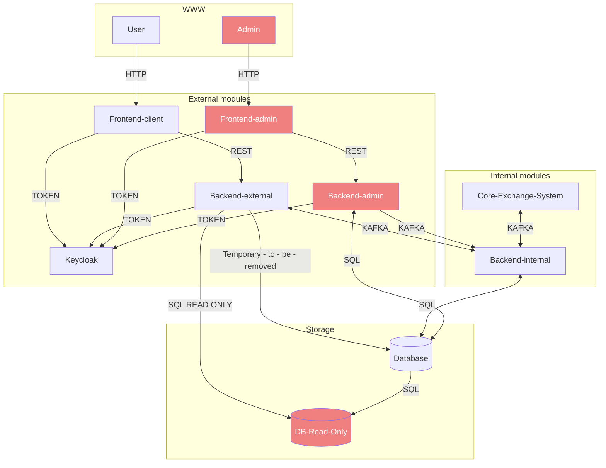

## System Architecture

Below is a high-level diagram for the Exchange Platform. Modules marked in red have not been created
yet.

```mermaid
graph TD
    User[User]
%%    Admin[Administrator]
    DB[(Database)]
    DB-Read-Only[(DB-Read-Only)]
    User -->|HTTP| Frontend-client
    Admin -->|HTTP| Frontend-admin
    Frontend-client -->|TOKEN| Keycloak
    Backend-external -->|TOKEN| Keycloak
    Backend-external <-->|KAFKA| Backend-internal
    Frontend-admin -->|TOKEN| Keycloak
    Backend-admin -->|TOKEN| Keycloak
    Backend-admin -->|KAFKA| Backend-internal
    Frontend-client -->|REST| Backend-external
    Core-Exchange-System <-->|KAFKA| Backend-internal
    Frontend-admin -->|REST| Backend-admin
    Backend-external -->|SQL READ ONLY| DB-Read-Only
    Backend-external -->|Temporary - to - be - removed| DB
    Backend-internal <-->|SQL| DB
    Backend-admin <-->|SQL| DB
    DB -->|SQL| DB-Read-Only

    subgraph WWW
        Admin
        User
    end

    subgraph External modules
        Frontend-admin
        Frontend-client
        Backend-external
        Backend-admin
        Keycloak
    end
    subgraph Internal modules
        Backend-internal
        Core-Exchange-System
    end

    subgraph Storage
        DB
        DB-Read-Only
    end
    classDef badBadEvent fill: #F08080, color: white
    class Admin badBadEvent
    class Frontend-admin badBadEvent
    class Backend-admin badBadEvent
    class DB-Read-Only badBadEvent
```

