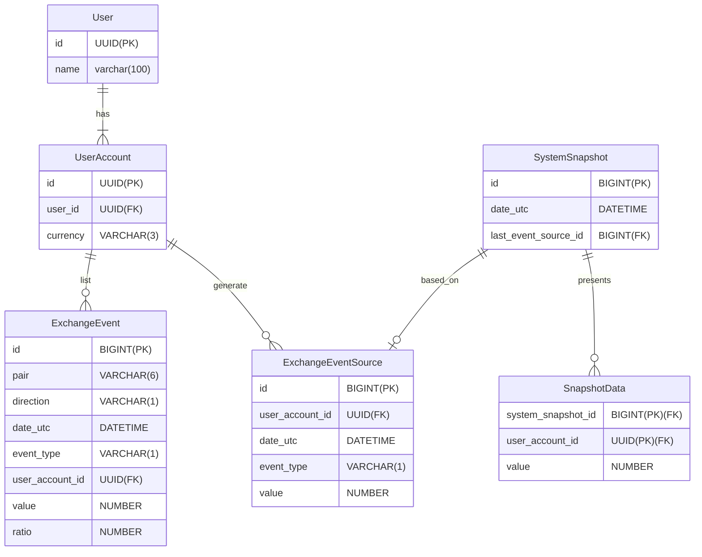

# Exchange database

## Recreate exchange schema

If you want to recreate database use this script to drop/create schema and then start Exchange
Backend External application to execute Liquibase scripts.

```shell
DROP SCHEMA exchange CASCADE;
CREATE SCHEMA exchange;
GRANT ALL PRIVILEGES ON SCHEMA exchange TO exchange;
```

## Database schema

